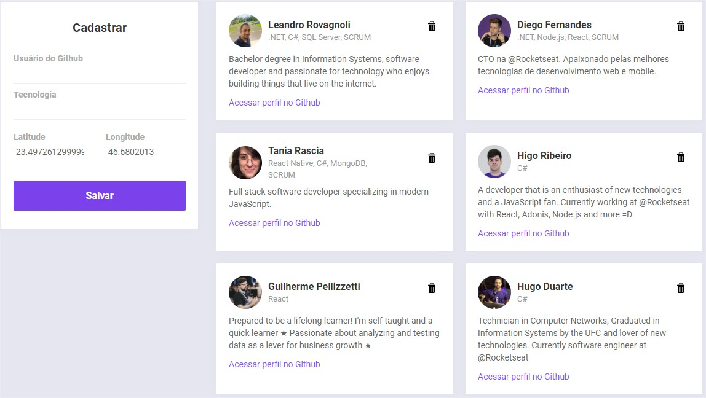
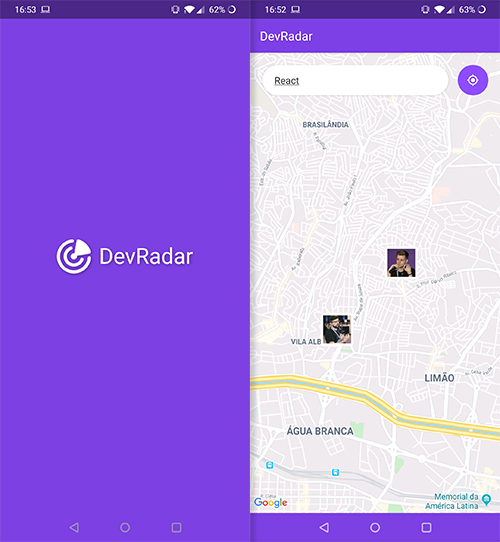
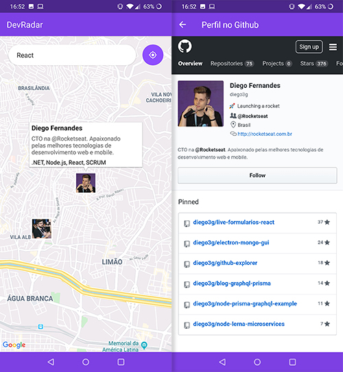

<h1 align="center">
    
</h1>

<h4 align="center">
  Projeto resultante da semana Omnistack 10 da Rocketseat.   Backend, Interface web para cadastro e aplicação mobile.
</h4>

  

  
  
  

  

## 💻 Projeto

O DevRadar é um projeto que visa conectar desenvolvedores próximos a você que trabalham com as mesmas tecnologias.

 

## :rocket: Tecnologias

Esse projeto foi desenvolvido com as seguintes tecnologias:

- [Node.js](https://nodejs.org/en/)
- [React](https://reactjs.org)
- [React Native](https://facebook.github.io/react-native/)
- [Expo](https://expo.io/)

 

# Interface Web
## [Live Demo](https://dev-radar-web-test.herokuapp.com "DevRadar Web")

  

 

# Mobile App

  
  

